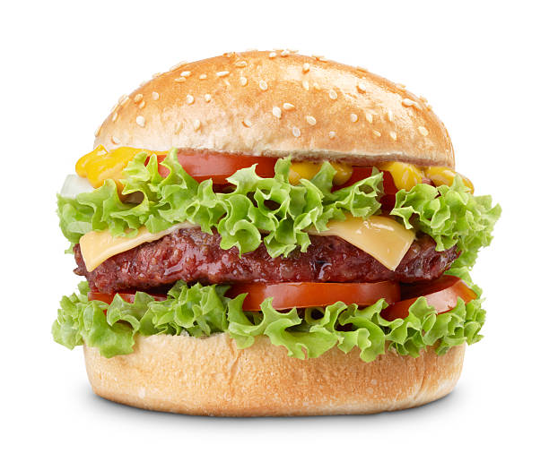

EF-Informatik

# Fabian Sutter

## Über mich
**Hobbies:**
- Gitarre spielen
- Turnverein  

**Codeprojekt:** 
- PET-Recycling Maschine
- Turnverein Noten-Berechnungs App  

**Lieblingsbücher:** [nicht vorhanden]  

**Lieblingsfächer:**
- EF-Informatik (natürlich ;-))
- Angewandte Mathematik 
- Physik° 
- Physik
- Mathematik
- Chemie 
- Biologie    

**Lieblingsverein:** [Turnverein Büren an der Aare](https://tvbueren.ch/)  

**Lieblingsessen:** 

## Ein Witz

Egal wie leer du bist, manche Leute sind ... .

## Noch ein Witz

Ich hab gestern meinen Besen verkauft.  
I don’t kehr.